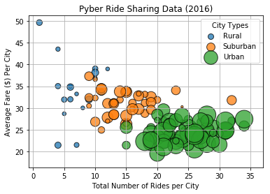
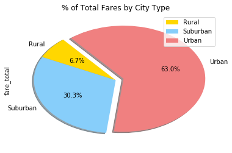
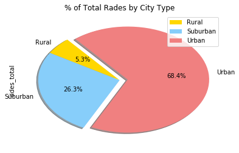
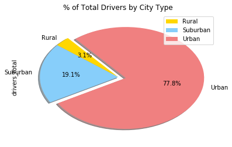

## The Power of Plots: Pyber

## Background

 Some ride sharing company (like Uber or Lyft) gives an access to its complete recordset of rides. This contains information about every active driver and historic ride, including details like city, driver count, individual fares, and city type.

### The objective is to build a [Bubble Plot](https://en.wikipedia.org/wiki/Bubble_chart) that showcases the relationship between four key variables:

* Average Fare ($) Per City
* Total Number of Rides Per City
* Total Number of Drivers Per City
* City Type (Urban, Suburban, Rural)

### In addition, there are three pie charts:

### Technology used: Pandas Library, Jupyter Notebook, Matplotlib, and Seaborn libraries.

